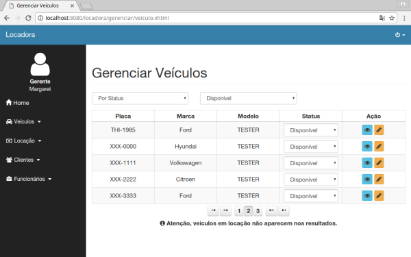
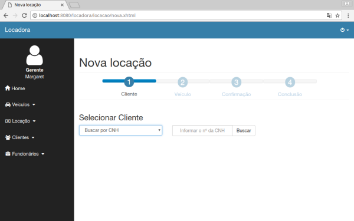
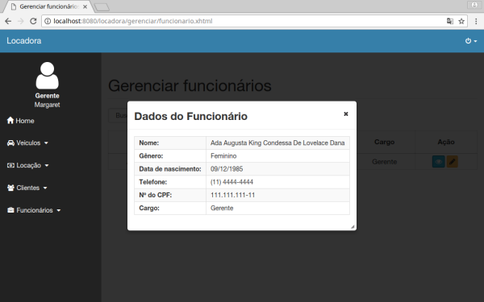
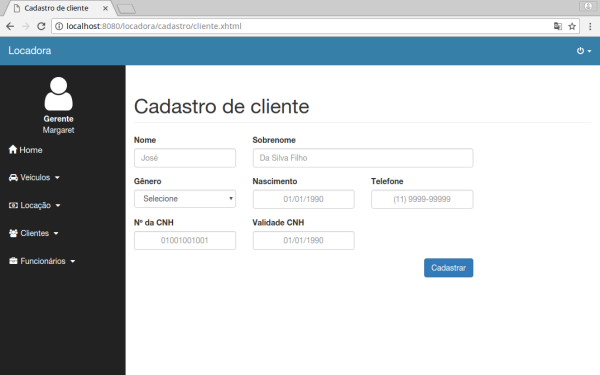
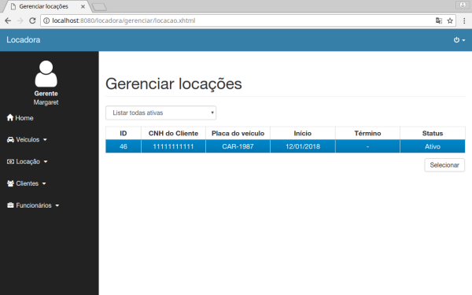
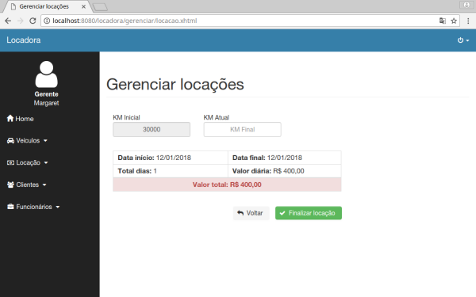

# Locadora de Veículos com JSF

[](https://www.codacy.com/app/tglima/Locadora?utm_source=github.com&amp;utm_medium=referral&amp;utm_content=tglima/Locadora&amp;utm_campaign=Badge_Grade)

Projeto de uma aplicação web para locação de veículos. Projeto sem fins comerciais, focado na prática, estudo e compreensão de recursos e frameworks do ecossistema Java.

## Screenshots da aplicação

<div align="center">

[](docs/imgs/img01.png)
[](docs/imgs/img02.png)
[](docs/imgs/img03.png)
[](docs/imgs/img04.png)
[](docs/imgs/img05.png)
[](docs/imgs/img06.png)

</div>

## Frameworks e Tecnologias Utilizadas

* JSF (Mojarra)
* Primefaces
* JPA
* Hibernate
* Maven
* Bootstrap
* MySQL
* Apache Tomcat

## Pré-requisitos

* JDK - versão 1.8 do Java, ou mais recente;
* Tomcat 8.0.x;
* MariaDB 10.1.x ou Mysql 5.7.x;
* Eclipse - IDE Eclipse na versão Neon ou IDE equivalente;
* Git - Para controle de versão;
* Maven - Para build e dependências.

## Como baixar uma cópia deste projeto
Clone este repositório com o seguinte comando:

```sh
git clone https://github.com/tglima/Locadora.git
```
Ou [baixe aqui](https://github.com/tglima/Locadora/archive/master.zip) o arquivo zip e o importe na sua IDE.


## Outras IDE's
O projeto foi desenvolvido na IDE Eclipse, mas acredito que ele consiga rodar nas principais IDE's (NetBeans e Intelij IDEA), pois sua estrutura foi estabelecida pelo Maven.


## Como gerar o Build do projeto

Acesse a raiz do projeto (onde se encontra o arquivo pom.xml) e execute o comando:

```sh
mvn clean install
```

O comando acima gera um arquivo WAR.

## Banco de Dados
O projeto está configurado para trabalhar com um banco de dados MySQL. Ainda nesta fase do projeto, o sistema depende de registros específicos do banco de dados, por esse motivo utilize [este backup do banco](docs/full_dump_2018-01-07.sql).

**IMPORTANTE**

O arquivo "[persistence.xml](https://github.com/tglima/Locadora/blob/master/src/main/resources/META-INF/persistence.xml)" deve ser alterado conforme suas configurações.


## Licença

>**This application is licensed under the [GPLv3](http://www.gnu.org/licenses/gpl-3.0.html).** <p>
This application is distributed in the hope that it will be useful, but WITHOUT ANY WARRANTY; without even the implied warranty of MERCHANTABILITY or FITNESS FOR A PARTICULAR PURPOSE. See the GNU General Public License for more details.

Este programa é software livre: você pode redistribuí-lo e/ou modificá-lo sob os termos da Licença Pública Geral GNU publicada pela Free Software Foundation ([GPLv3](http://www.gnu.org/licenses/gpl-3.0.html)).

-----
